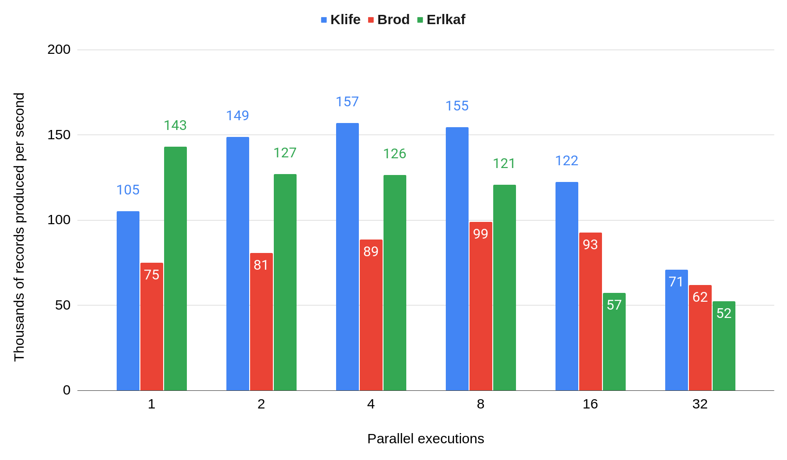

[](https://github.com/oliveigah/klife/actions/workflows/ci.yml)
[](https://hex.pm/packages/klife)
[](https://hexdocs.pm/klife)

# Klife

Klife is a high-performance Kafka client built from the ground up with minimal dependencies.
Currently, Klife supports producer functionality, with plans to add consumer features in the future.

To achieve high batch efficiency and ensure compatibility with evolving protocol versions, Klife
leverages [Klife Protocol](https://github.com/oliveigah/klife_protocol). This efficiency allows
Klife to deliver exceptional performance, with throughput improvements of up to 15x over other
community Kafka clients in some scenarios.

## Features

Currently, Klife provides producer functionality, with plans to expand into consumer
features as the project develops. Key features include:

- **Efficient Batching**: Batches data to the same broker in a single TCP request per producer.
- **Minimal Resource Usage**: Only one connection per broker for each client, optimizing resource usage.
- **Exactly Once Semantics (EOS)**: Providing safe retries with idempotency on the protocol level.
- **Synchronous and Asynchronous Produce Options**: Synchronous produces return the offset, while asynchronous produces support callbacks.
- **Batch Produce API**: Allows batching for multiple topics and partitions.
- **Automatic Cluster and Metadata Management**: Automatically adapts to changes in cluster topology and metadata.
- **Testing Utilities**: Includes helper functions for testing against a real broker without complex mocking.
- **Simple Configuration**: Streamlined setup for straightforward use.
- **Comprehensive Documentation**: Includes examples and explanations of trade-offs.
- **Custom Partitioner per Topic**: Configurable partitioning for each topic.
- **Transactional Support**: Supports transactions in an Ecto-like style.
- **SASL Authentication**: Currently supports plain authentication.
- **Protocol Compatibility**: Supports recent protocol versions, with forward compatibility in mind.

## Installation

### Add `klife` to your list of dependencies in `mix.exs`:

```elixir
def deps do
  [
    {:klife, "~> 0.1.0"}
  ]
end
```

## Basic Usage

### Define your application client

```elixir
defmodule MyApp.Client do
  use Klife.Client, otp_app: :my_app
end
```

### Add basic configuration

```elixir
config :my_app, MyApp.Client,
  connection: [
    bootstrap_servers: ["localhost:19092", "localhost:29092"],
    ssl: false
  ]
```

### Add the client to the supervision tree

```elixir
children = [ MyApp.Client ]

opts = [strategy: :one_for_one, name: Example.Supervisor]
Supervisor.start_link(children, opts)
```

### Call the producer API

```elixir
my_rec = %Klife.Record{value: "my_val_1", topic: "my_topic_1"}
{:ok, %Klife.Record} = MyApp.Client.produce(my_rec)
```

Checkout the `Klife.Client` [docs](https://hexdocs.pm/klife/Klife.Client.html) for more details

## Producer performance

I've test it against the 3 awesome community kafka libraries [brod](https://github.com/kafka4beam/brod)
and [kafka_ex](https://github.com/kafkaex/kafka_ex) and [erlkaf](https://github.com/silviucpp/erlkaf)
which are the most popular ones.

The relevant client configuration should be equal on all clients and they are:

- required_acks: all
- max_inflight_request: 1
- linger_ms: 0
- max_batch_size: 512kb

### Produce sync

In order to test sync produce performance we prepared a benchmark that uses [benchee](https://github.com/bencheeorg/benchee) to produce
kafka records on kafka cluster running locally.

The details can be checked out on `benchmark.ex` mix task and the results on `bechmark_results`.

To reproduce it on your setup you can run (16 is the benchee parallel value):

```
bash start-kafka.sh
mix benchmark producer_sync 16
```

Each iteration of the benchmark produces 3 records for 3 different topics in paralel and wait for the completion
in order to move to the next iteration.

The main point driving the Klife's performance is the batching efficiency. As far as I can tell:

- Klife: Batches everything that can be batched together in a single TCP request
- Brod: Batches records only for the same topic/partition in a single TCP request
- Kafka_ex: Does not batch records (I'm not sure if there is a way to change this behaviour)

With this scenario I've executed the benchmark increasing the `parallel` attribute from
benchee from 1 to 16, doubling it each round. The results are the following:


### Produce async

In order to test async produce performance we prepared a test script that produces records asynchronously on
a kafka cluster running locally.

The asynchronous benchmark spawns N parallel processes producing to one of 3 topics in a loop. After 10 seconds,
it calculates the difference between the initial and current offsets for each topic partition to determine
the total records produced and the throughput (records per second).

The details can be checked out on `async_producer_benchmark.ex`.

To reproduce it on your setup you can run (16 is the N value):

```
bash start-kafka.sh
mix benchmark producer_async 16
```



## Compatibility with Kafka versions

Although `Klife Protocol` give us the capability to support all the latests versions
for now Klife uses fixed versions of the protocol that are not the latest for each message.

I have plans to evolve this slowly as the project grows and I find a good way to deal
with multiple protocol versions at the same time on the code.

For now the message versions can be checked at `lib/klife/connection/message_versions.ex`

For performance reasons I'm aiming to support only versions after the flexible version that
were introduced on kafka 2.4 on KIP-482.

But should not be hard to support versions prior to that, if you are willing to try Klife
but you use an older version of kafka let me know and we can see if it is possible.
